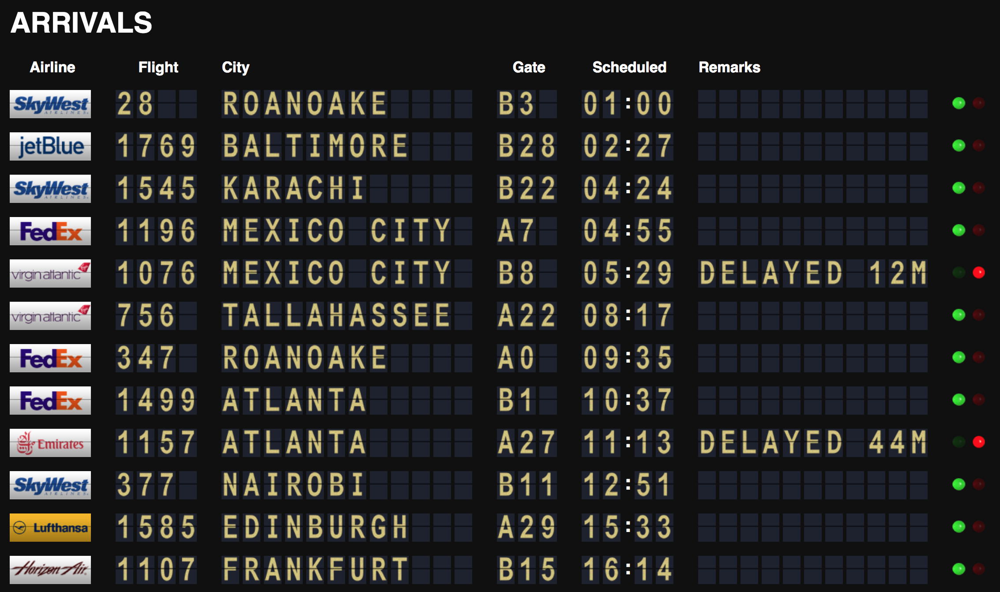

# Airport Split-Flap/Solari Board

This is a simulation of a split-flap display (often called a Solari board) designed to run in a web browser. It dynamically loads JSON data from APIs such as [Aviationstack](https://aviationstack.com/) & [LaminairSystems](https://www.laminairsystems.com/) (currently only working with Aviationstack)  and renders that data as characters and images on the board. Individual characters are animated using CSS sprites.

The look and feel are fully configurable by changing the markup and using different sprite images, and the included files are simply examples intended to get you started with your own project.
## Credits 

This project was originally forked from [baspete/Split-Flap](https://github.com/baspete/Split-Flap) and modified by Kevin Elliott from [airframesio/airport-solari-board](https://github.com/airframesio/airport-solari-board)

This repo has been made possible by the work of Pete Butler ([baspete](https://github.com/baspete)) and modified to work with APIs by Kevin Elliott ([Airframes](https://github.com/airframesio))

## Installation

```
git clone https://github.com/bzyg7b/airport-solari-board.git
cd Split-Flap
npm install
```
Then create a .env file and add your API keys:
```
AVIATION_STACK_ACCESS_KEY=API-KEY-GOES-HERE 
LAMINAR_USER_KEY=API-KEY-GOES-HERE 
``` 
To start the program run 
```
node app.js
```
Navigate to `http://locahost:8080` in your browser.

## Screenshot

